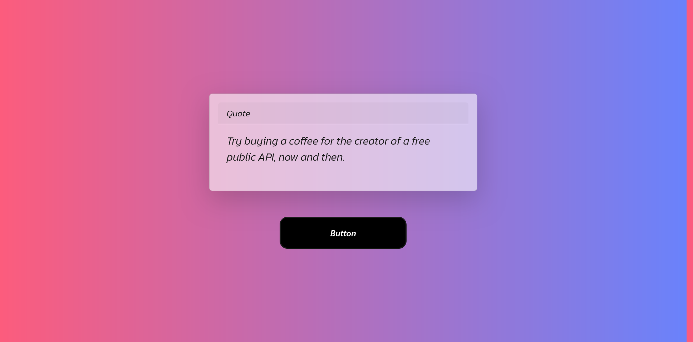

# 🚀 Quote Fetcher - API Mastery Challenge #1

A sleek and interactive web application that fetches real-time "Advice & Quotes" from an external API. This project was built as a dedicated challenge to master **API integration** and **Asynchronous JavaScript** before diving into full-scale social media platform development.

## 🌟 Key Features
- **Real-time Data:** Fetches live advice slips using the **Axios** library.
- **Modern UI:** Features a clean, **Glassmorphism** design for a premium look.
- **Cross-browser Compatible:** Optimized to run smoothly on Chrome, Firefox, and Safari.
- **Responsive Design:** Fully responsive layout built with **Bootstrap 5**.

## 🛠️ Tech Stack
* **HTML5 & CSS3** (Custom UI & Layout).
* **Bootstrap 5** (Responsive Grid & Components).
* **JavaScript (ES6+)** (DOM Manipulation & Logic).
* **Axios** (Promise-based HTTP client).

## 🔌 API Source
Data is powered by the [Advice Slip JSON API](https://api.adviceslip.com/).

## 📸 Preview

## ⚙️ How It Works
1. **Request:** Upon page load or button click, an Axios `GET` request is sent to the API.
2. **Handle:** The promise is handled to extract the specific advice string from the `JSON` response.
3. **Display:** The DOM is updated dynamically using `innerHTML` to show the new quote without refreshing the page.

---
Developed with passion by an aspiring Web Developer 👨‍💻
